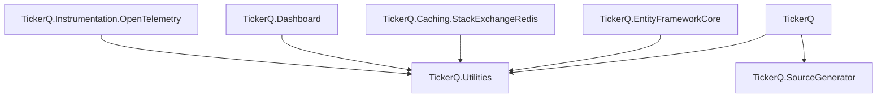

TickerQ ships as seven packages. The core package and a persistence provider are the only required dependencies for a working scheduler. All other packages are optional.

<Warning>
  Always keep every TickerQ package in your project on the same version. The packages are versioned and released together. Mixing versions will cause runtime errors.
</Warning>

## Package overview

<CardGroup cols={2}>
  <Card title="TickerQ" icon="gear" href="/quickstart">
    Core scheduler engine. Registers background services, the dispatcher, the thread pool, and the dependency injection extensions.
  </Card>
  <Card title="TickerQ.Utilities" icon="wrench" href="/concepts/ticker-functions">
    Shared types, entities, interfaces, and the `[TickerFunction]` attribute. Referenced by all other packages. You rarely need to install this directly.
  </Card>
  <Card title="TickerQ.EntityFrameworkCore" icon="database" href="/persistence/ef-core">
    EF Core persistence provider. Supports PostgreSQL, SQL Server, SQLite, and MySQL via your existing `DbContext`.
  </Card>
  <Card title="TickerQ.Caching.StackExchangeRedis" icon="server" href="/persistence/redis">
    Redis persistence and distributed coordination. Provides heartbeats, dead-node cleanup, and lock-based scheduling for multi-node deployments.
  </Card>
  <Card title="TickerQ.Dashboard" icon="chart-line" href="/dashboard/setup">
    Real-time monitoring dashboard powered by SignalR. Monitor, inspect, and manage jobs with no paid add-ons.
  </Card>
  <Card title="TickerQ.Instrumentation.OpenTelemetry" icon="activity" href="/observability/opentelemetry">
    OpenTelemetry activity tracing for job executions. Plugs into your existing observability stack.
  </Card>
  <Card title="TickerQ.SourceGenerator" icon="bolt" href="/configuration/aot-trimming">
    Roslyn source generator that emits compile-time job function registration. Included automatically as a transitive dependency of `TickerQ` — you never need to install this directly.
  </Card>
</CardGroup>

## Installation

Install the packages you need via the .NET CLI.

<CodeGroup>

```bash Core (required)
dotnet add package TickerQ
```

```bash EF Core persistence
dotnet add package TickerQ.EntityFrameworkCore
```

```bash Redis persistence
dotnet add package TickerQ.Caching.StackExchangeRedis
```

```bash Dashboard
dotnet add package TickerQ.Dashboard
```

```bash OpenTelemetry
dotnet add package TickerQ.Instrumentation.OpenTelemetry
```

</CodeGroup>

Most projects only need two packages:

```bash Typical setup
dotnet add package TickerQ
dotnet add package TickerQ.EntityFrameworkCore
```

## Dependency graph



`TickerQ.Utilities` is the shared foundation. All other packages depend on it. `TickerQ.SourceGenerator` is only active at compile time and produces no runtime assembly.

## Package details

| Package | NuGet name | Purpose |
|---|---|---|
| Core | `TickerQ` | Scheduler engine, background services, DI extensions |
| Utilities | `TickerQ.Utilities` | Shared types, entities, `[TickerFunction]`, `TickerFunctionContext` |
| EF Core | `TickerQ.EntityFrameworkCore` | EF Core persistence (PostgreSQL, SQL Server, SQLite, MySQL) |
| Redis | `TickerQ.Caching.StackExchangeRedis` | Redis persistence and multi-node coordination |
| Dashboard | `TickerQ.Dashboard` | Real-time SignalR monitoring UI |
| OpenTelemetry | `TickerQ.Instrumentation.OpenTelemetry` | Activity tracing |
| Source generator | `TickerQ.SourceGenerator` | Compile-time function registration (transitive, no direct install needed) |

## Persistence providers

TickerQ ships with three persistence options. Only one should be active at a time.

**In-memory (default).** No configuration required. Jobs are lost when the process restarts. Suitable for local development and testing only.

**EF Core.** Recommended for most applications. Uses your existing database and `DbContext`. Supports PostgreSQL, SQL Server, SQLite, and MySQL. See [EF Core persistence](/persistence/ef-core).

**Redis.** Best for multi-node deployments. Provides distributed coordination in addition to persistence. See [Redis persistence](/persistence/redis).

<Info>
  When no `AddOperationalStore` call is present, TickerQ automatically falls back to the in-memory provider. The fallback is replaced the moment you configure EF Core or Redis.
</Info>

## Version pinning

TickerQ packages share a single version number and are released in lockstep. If you have multiple TickerQ packages installed, they must all be on the same version.

```xml MyApp.csproj — correct
<PackageReference Include="TickerQ" Version="1.2.3" />
<PackageReference Include="TickerQ.EntityFrameworkCore" Version="1.2.3" />
<PackageReference Include="TickerQ.Dashboard" Version="1.2.3" />
```

<Warning>
  Do not pin packages to different versions. Mismatched packages will cause type resolution failures at runtime because `TickerQ.Utilities` types must be binary-compatible across all packages.
</Warning>
